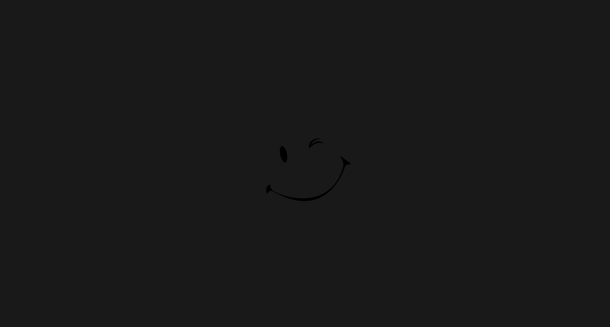

# Quark

Quark is a 3D game engine in early development inspired by Hazel Game Engine.
Designed for learning purposes.
Official support for macOS and Linux is on it's way!

***


# Installation & Setup

## On Windows
1. Run `git clone --resursive https://github.com/ThomasWorkOnline/Quark.git` in your desired environment folder.
2. After cloning this repository, run the script `GenVisualStudioSolution20xx_Win.bat` located under `Scripts/Windows`.
3. Open the Visual Studio solution and hit build! Build for your desired configuration(s).

Note: *On Visual Studio, your configuration will automatically be set and can be chosen via the Configuration Manager.*

## On MacOS
1. Run `git clone --resursive https://github.com/ThomasWorkOnline/Quark.git` in your desired environment folder.
2. After cloning this repository, run the script `GenMakefile_MacOS.sh` located under `Scripts/Macos`.
3. Navigate to the project root directory and type `make config=<config>`.
### Different configs:
	make config=debug
	make config=release
	make config=dist

## On Linux
Coming soon!

## Building Quark without Premake
1. Run `Scripts/GenInclude_<platform>` script. This will generate the `include` directory.

Note: *`GenInclude_...` will also create a 'lib' directory and copy the binaries inside if they are built.*

## Dependencies
- [glm](https://github.com/g-truc/glm)
- [entt](https://github.com/skypjack/entt)
- [spdlog](https://github.com/gabime/spdlog/tree/083ea59fbd06add6f973636acca93ae0dfc0b73f)

*(all dependencies are located inside the `Quark/vendor` folder)*.
All you need to do is to include the designated 'Quark/premake5.lua' build step to your premake5 script.

## Build Configurations
### Debug
This config includes no optimizations and enables asserts aswell as logging. It is well suited for testing.
### Release
This config includes optimizations and strips assertions and log traces. Performance metrics are present. I would not suggest you run tests using this config. Use this config to run benchmarks and test your app's performance.
### Dist
This config includes full optimizations, strips assertions and log traces. Warnings and errors are always displayed.
On Windows, the app will not launch a debugging console.
Use this config to ship your distributable application.

*I encourage using dist builds with optimizations for distribution and debug while testing.
Release mode can be useful when you need to test performance.*

# How to use

The following examples will guide you in learning the Quark API.

<ins>**1. Creating a Quark application**</ins>
```c++
// Single header include
#include <Quark.h>

using namespace Quark;

// Create a class extending `Quark::Application`
class YourApplication : public Application
{
	...
};
```
	
<ins>**2. Launching your app**</ins>

Use `Quark::CreateApplication()` as shown in this snippet below:

```c++
#include <Quark/EntryPoint.h>

namespace Quark {

	Application* CreateApplication()
	{
		return new YourApplication();
	}
};
```

Quark already provides the default entry point for launching your program.
Redefining `main()` will cause a duplicate symbol linking error.
Make sure to define `CreateApplication()` inside the Quark namespace.

Allocating an instance of your application can potentially be very memory heavy.
Therefore, instantiating your application on the stack is not adviced.
By dynamically allocating your app, you prevent high stack usage which can lead to bugs and crashes.

Note: *On Windows distribution builds, the app with launch without the console using the builtin WinMain() entry point (see [EntryPoint.cpp](Quark/src/Quark/EntryPoint.cpp) for details)*

*If you wan't full details, see [Core.h](Quark/src/Quark/Core/Core.h)*

<ins>**3. Implementing some functionality**</ins>
```c++
class YourApplication : public Application
{
public:
	// Called each tick
	// Elapsed time holds the time delta in seconds between each update ticks
	virtual void OnUpdate(Timestep elapsedTime) override
	{
		// Run your app logic here:
		...
	}
	
	// Called each frame
	virtual void OnRender()
	{
		// Render here:
		...
	}
};
```

<ins>**4. Handling events**</ins>

Events provide a way to hook into certain application actions such as:
mouse and keyboard inputs, window moved, resized, minimized, maximized and much more.
The following examples will guide you through using Quark events:

```c++
class YourApplication : public Application
{
public:
	virtual void OnEvent(Event& e) override
	{
		// Create an dispatcher object with the given event reference
		EventDispatcher dispatcher(e);
	
		...
	}
};
```

Event dispatchers are used to associate an event type with a given function.
The event handler must have the following signature:
```c++
bool Function(EventType&);
```

If the function you are linking to is a class member function, you'll have to use the `ATTACH_EVENT_FN` macro to pass the implicit `this` parameter as an argument.
For instance, let's write a function that handles keyboard input.

```c++
class YourApplication : public Application
{
public:
	virtual void OnEvent(Event& e) override
	{
		// Create an dispatcher object with the given event reference
		EventDispatcher dispatcher(e);
	
		// Route all `KeyPressedEvent` to `YourApplication::OnKeyPressed`
		dispatcher.Dispatch<KeyPressedEvent>(ATTACH_EVENT_FN(YourApplication::OnKeyPressed));
	}
	
private:
	// Our custom KeyPressedEvent handler
	bool OnKeyPressed(KeyPressedEvent& e)
	{       //               ^
		// Note that the event has been cast to the right type
		std::cout << e.GetKeyCode() << std::endl;
	
		// Returns if the event has been handled
		// A handled event will not be propagated to other handlers
		return false;
	}
};
```

By returning false, we do not prevent the event propagation. Returning true can be useful when you wan't to prevent the app from propagating the event any further.
For instance, in a FPS, you would not wan't your player controller to shoot when left-clicking in your inventory. Furthermore, your player controller should not be aware that a click event has been fired. By returning true, Quark internally discards the event for further handlers.

<ins>**5. Basic 2D rendering**</ins>

Quark provides a easy-to-use batched 2D renderer directly available when you create an application.
Let's render a basic textured quad to the screen using it.

First, we'll have to load a texture:

```c++
class YourApplication : public Application
{
public:
	YourApplication()
	{
		// Loading our texture
		// This returns a smart reference to a newly created texture object
		m_Texture = Texture2D::Create("assets/textures/Example1_BasicRendering.png");
	}

private:
	Ref<Texture2D> m_Texture;
};
```

In order for Quark to render objects, we have to give it context about our scene.
Let's start by creating a camera object that will hold our scene projection.

## Camera types
[SceneCamera](Quark/src/Quark/Scene/SceneCamera.h)

For our simple 2D needs, I'll be using an orthographic camera.
Finally, we can start drawing things to the screen:

```c++
class YourApplication : public Application
{
public:
	YourApplication()
	{
		// Loading our texture
		m_Texture = Texture2D::Create("assets/textures/Example1_BasicRendering.png");
		
		// Setting the projection type to be orthographic in screen space [-1, 1]
		m_Camera.SetOrthographic(1.0f);
	}
	
	// Called each frame
	virtual void OnRender() override
	{
		// Starting a fresh 2D scene
		Renderer2D::BeginScene(m_Camera.GetProjection(), Mat4f(1.0f)); // <-- This is the camera view matrix, we'll stick to a unit matrix

		// Submitting a unit sprite with our given texture
		Renderer2D::DrawSprite(m_Texture);

		// Telling Quark we are done with the current scene
		// The renderer will optimize and draw the geometry here
		Renderer2D::EndScene();
	}

private:
	Ref<Texture2D> m_Texture;
	SceneCamera m_Camera;
};
```

## Example 1 Outputs:


<ins>**5. Handling window size**</ins>

So far, we've created our camera using the `SetOrthographic()` method;
This initialization sets the projection matrix to a [-size/2, size/2] sized orthographic projection.
This doesn't give us the result we wan't since we don't take into consideration the screen aspect ratio.
Let's fix this:

```c++
class YourApplication : public Application
{
public:
	YourApplication()
	{
		// Loading our texture
		m_Texture = Texture2D::Create("assets/textures/Example1_BasicRendering.png");

		// Setting the projection type to be orthographic in screen space [-1, 1]
		m_Camera.SetOrthographic(1.0f);

		// Initial resize of the camera with the viewport size
		auto& window = GetWindow();
		m_Camera.Resize(window.GetWidth(), window.GetHeight());
		
		// Note: We'll see how to automate this in a future example
	}

	virtual void OnEvent(Event& e) override
	{
		EventDispatcher dispatcher(e);
		// Binding our events
		dispatcher.Dispatch<WindowResizedEvent>(ATTACH_EVENT_FN(YourApplication::OnWindowResized));
	}

	// Called each frame
	virtual void OnRender() override
	{
		// Starting a fresh 2D scene
		Renderer2D::BeginScene(m_Camera.GetProjection(), Mat4f(1.0f)); // <-- This is the camera view matrix, we'll stick to a unit matrix

		// Submitting a unit sprite with our given texture
		Renderer2D::DrawSprite(m_Texture);

		// Telling Quark we are done with the current scene
		// The renderer will optimize and draw the geometry here
		Renderer2D::EndScene();
	}

private:
	// This method does the camera update when the window is resized
	bool OnWindowResized(WindowResizedEvent& e)
	{
		// Updating the camera projection every time the window is resized
		m_Camera.Resize(e.GetWidth(), e.GetHeight());
		return false;
	}

private:
	Ref<Texture2D> m_Texture;
	SceneCamera m_Camera;
};
```

## Corrected Output:


It's also trivial to render a colored sprite using a different overload of the `DrawSprite()` function:

```c++
class YourApplication : public Application
{
public:
	[...]

	// Called each frame
	virtual void OnRender() override
	{
		// Starting a fresh 2D scene
		Renderer2D::BeginScene(m_Camera.GetProjection(), Mat4f(1.0f)); // <-- This is the camera view matrix, we'll stick to a unit matrix

		// Submitting a colored sprite
		Renderer2D::DrawSprite({ 1.0f, 0.0f, 0.0f, 1.0f });

		// Telling Quark we are done with the current scene
		// The renderer will optimize and draw the geometry here
		Renderer2D::EndScene();
	}
	
	[...]
};
```

## Colored Quad Output:


## Source Code
[See this example source](Demos/src/Example1_BasicRendering.h)

# Dependencies
glm: https://github.com/g-truc/glm<br />
entt: https://github.com/skypjack/entt<br />
spdlog: https://github.com/gabime/spdlog/tree/083ea59fbd06add6f973636acca93ae0dfc0b73f<br />

Feel free to explore!
